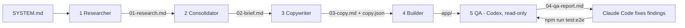
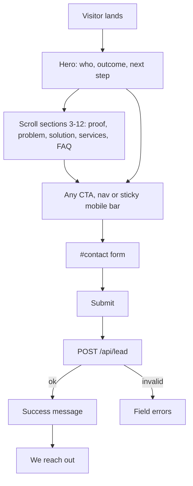

# Process Flow

- How the **AR DataScienceMinds** landing page is built (pipeline) and how a visitor moves through it (conversion flow).
- Sources: `SYSTEM.md`, `AGENTS.md`, `CLAUDE.md`, `Agent/*.md`, `app/app/api/lead/route.ts`.

## 1. Build pipeline

| # | Agent | Definition | Reads | Writes | Tools |
|---|---|---|---|---|---|
| 1 | Researcher | `Agent/researcher.md` | `SYSTEM.md` | `workspace/01-research.md` | WebSearch, WebFetch |
| 2 | Consolidator | `Agent/consolidator.md` | `01-research.md` | `workspace/02-brief.md` | Read, Write |
| 3 | Copywriter | `Agent/copywriter.md` | `02-brief.md` | `workspace/03-copy.md`, `app/content/copy.json` | Read, Write |
| 4 | Builder | `Agent/builder.md` | `03-copy.md`, `copy.json` | `app/` | Read, Write, Edit, Bash |
| 5 | QA (Codex) | `Agent/qa.md` | whole repo | `workspace/04-qa-report.md` | read-only + test runs |

## 2. Pipeline rules

| Rule | Detail |
|---|---|
| Strict order | Stages run 1 to 5; each reads only its declared input |
| Handoff | Each output ends with a `## Handoff` block (done, assumptions, open questions) |
| Re-run a stage | Delete its output, re-invoke that agent, then re-run every later stage |
| QA is read-only | Codex edits only `workspace/04-qa-report.md`; Claude Code applies fixes |
| Honesty | No invented clients, quotes, metrics; gaps stay `[REPLACE: ...]` |
| Copy | Lives in `app/content/copy.json`, mirrored in `workspace/03-copy.md`; never hard-coded in components |
| Git | One commit per stage on `claude/ai-consulting-landing-page-j8kmgv`; no PRs or deploys unless asked |

## 3. QA loop

- Codex runs, in order: `npm install && npm run lint`, `ALLOW_PLACEHOLDERS=1 npm run build`, `npm run test:e2e`.
- Findings carry severity (Blocker / Major / Minor / Note), file and line, repro and smallest fix.
- Claude Code fixes them and re-runs `npm run test:e2e`. Tests are never edited or deleted to get green.
- Run Codex via `npm run qa:codex` from `app/`.

## 4. The page: 13 sections (fixed order)

| # | Section | # | Section |
|---|---|---|---|
| 1 | Sticky nav + CTA | 8 | Process |
| 2 | Hero | 9 | Case studies |
| 3 | Social proof bar | 10 | Testimonials |
| 4 | Problem | 11 | About / authority |
| 5 | Cost of inaction | 12 | FAQ / objections |
| 6 | Solution / unique mechanism | 13 | Final CTA + form |
| 7 | Services | | |

## 5. Visitor flow

- Single goal: click a CTA, fill the form, we reach out.
- Every CTA targets `#contact`.

## 6. Lead submission (`POST /api/lead`)

| Step | Behaviour | Response |
|---|---|---|
| 1 | Per-IP rate limit | 429 if exceeded |
| 2 | Body size cap (10 KB) | 413 if larger |
| 3 | Parse JSON | 400 if malformed |
| 4 | Honeypot field filled | Fake `ok: true`, logged, not stored |
| 5 | Zod validation (same schema as client) | 400 with per-field messages |
| 6 | Supabase env missing | Dev: logged, `ok: true`. Production: 500 |
| 7 | Insert into `leads` (service key, server only) | `ok: true`, or 500 on insert error |

## 7. Quality gates

| Gate | Command / check |
|---|---|
| Lint | `npm run lint` |
| Build | `npm run build` (fails while `[REPLACE` remains unless `ALLOW_PLACEHOLDERS=1`) |
| E2E | `npm run test:e2e` (own dev server, port 3200) |
| Screenshots | 375px and 1280px |
| Security | No secrets in git, RLS on `leads`, server-side validation |

## 8. Definition of done (from `CLAUDE.md`)

- All 13 sections render with copy from `copy.json`.
- Valid submission stored; invalid rejected with clear messages.
- Lint and build pass; screenshots checked.
- Handoff notes list remaining `[REPLACE]` items for the owner.
